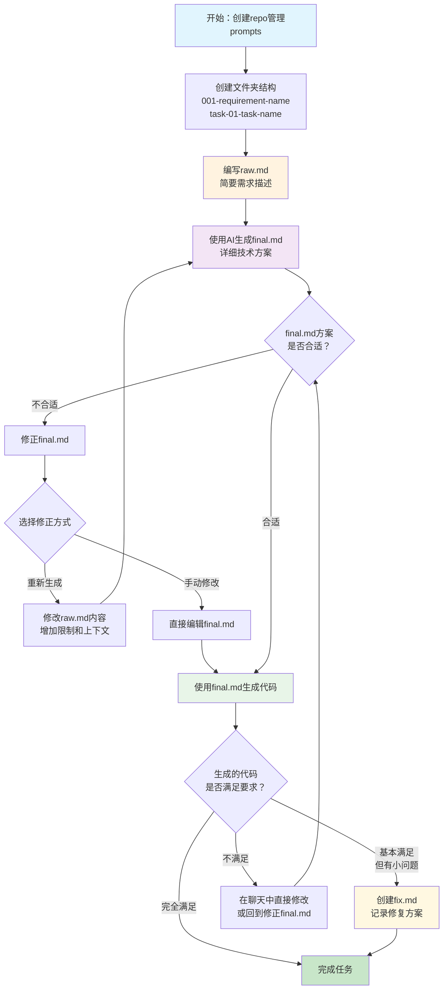
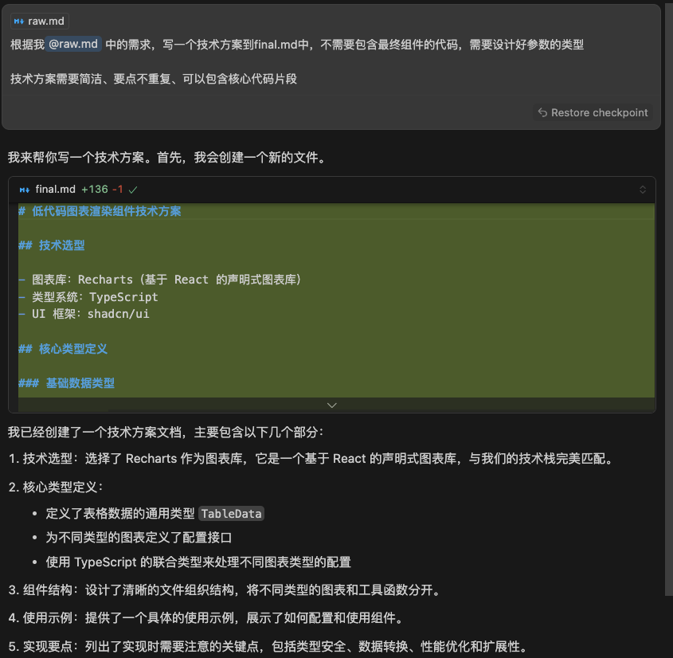
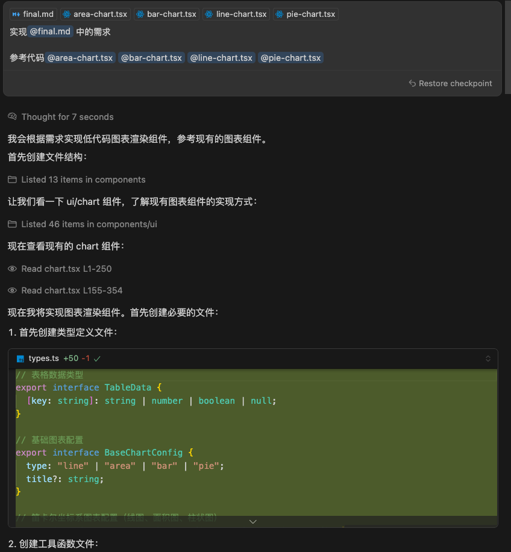

# 快速开始

## 操作实践

1. 在 repo 中统一管理所有的 prompts
2. 使用文件夹管理一组 task
3. 开发者在 raw.md 中编写自己的简要需求，由 AI 梳理为更详细的 final.md 结构化 prompt
4. 使用 final.md 进行代码生成

目录结构示例：

import { FileTree } from "nextra/components";

<FileTree>
  <FileTree.Folder name="001-create-global-rules" defaultOpen>
    <FileTree.File name="final.md" />
  </FileTree.Folder>
  <FileTree.Folder name="002-standardize-api-call" defaultOpen>
    <FileTree.Folder name="task-01-demo-code" defaultOpen>
      <FileTree.File name="raw.md" />
      <FileTree.File name="final.md" />
    </FileTree.Folder>
    <FileTree.Folder name="task-02-create-rule" defaultOpen>
      <FileTree.File name="final.md" />
    </FileTree.Folder>
  </FileTree.Folder>
  <FileTree.Folder name="003-shadcn-ui-rule" defaultOpen>
    <FileTree.File name="final.md" />
  </FileTree.Folder>
  <FileTree.Folder name="004-solution-doc-rule" defaultOpen>
    <FileTree.File name="raw.md" />
    <FileTree.File name="final.md" />
  </FileTree.Folder>
</FileTree>

## 步骤详解

### 总流程



### 文件夹命名

- 使用 001-requirement-name 来管理一个大的需求，使用三位数因为需求通常不会超过 999 个
- 子目录使用 01-task-name 来管理，使用两位数因为子任务通常不会超过 99 个

### 编写 raw.md

参考如下格式编写原始需求

```md
我需要 xxxx

## 上下文 1

上下文 1 的内容

## 文档 1

文档 1 的内容

## 目标

- 定义某种规范/结构
- 实现某个位置的代码
```

### 生成 final.md

使用如下类似的提示词生成 final.md

我们期望 final.md 中尽可能关注细节，但先不实现具体代码

```md
根据 @raw.md 中的需求，写一个技术方案到 final.md 中，不需要包含最终组件的代码，需要设计好参数的类型

技术方案需要简洁、要点不重复、可以包含核心代码片段
```

效果图：


### 修正 final.md

final.md 的技术方案可能并不合适，看情况选择下面的几种方式修正 final.md

- 重新生成：修改 raw.md 中的原始需求、加上限制、提供更多上下文，重新生成 final.md
- 手动修改：和预期偏差不多时，可以手动修改 final.md 中的内容，以免重新生成改变了方案

### 使用 final.md 生成代码

使用如下类似的提示词生成 final.md，最好直接引用相关文件，减少 cursor 自己检索的不确定性

```md
实现@final.md 中的需求

参考代码 @area-chart.tsx @bar-chart.tsx @line-chart.tsx @pie-chart.tsx
```

效果图：


### fix.md（可选）

当 final.md 生成的代码效果不错，但有少许问题时，不建议重新生成

可以直接在聊天中修改，也可以创建 fix.md 来修复

fix.md 起到了记录和提示的作用
